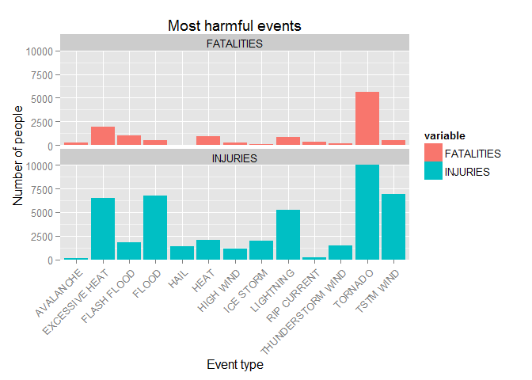
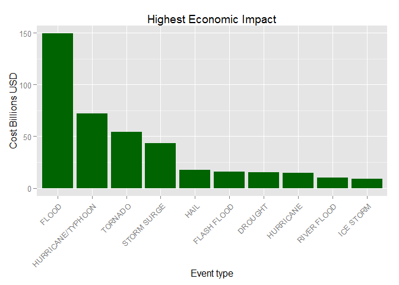

# Analyze population health and economic impact of weather events in the US
# Synopsis

Storms and other severe weather events can cause both public health and economic problems for communities and municipalities.

Based on the U.S. National Oceanic and Atmospheric Administration's (NOAA) storm database, we will respond to two questions:

1. Across the United States, which types of events are most harmful with respect to population health?
2. Across the United States, which types of events have the greatest economic consequences?

The answers to these questions will appear in the **Results** section of this article.

By answering these questions, the authorities can prioritize their actions following weather forecasts warning of such events.

# Data Processing

### R setup section


```r
rm(list=ls())
options(stringsAsFactors = FALSE)

if (!is.element("DBI",installed.packages()) ) {install.packages("DBI")}
library(DBI)

if (!is.element("RSQLite",installed.packages()) ) {install.packages("RSQLite")}
library(RSQLite)

if (!is.element("proto",installed.packages()) ) {install.packages("proto")}
library(proto)

if (!is.element("gsubfn",installed.packages()) ) {install.packages("gsubfn")}
library(gsubfn)

if (!is.element("sqldf",installed.packages()) ) {install.packages("sqldf")}
library(sqldf)

if (!is.element("reshape2",installed.packages()) ) {install.packages("reshape2")}
library("reshape2")

if (!is.element("ggplot2",installed.packages()) ) {install.packages("ggplot2")}
library(ggplot2)

if (!is.element("tcltk",installed.packages()) ) {install.packages("tcltk")}
library(tcltk)
```

### Load data


```r
if (!file.exists("repdata-data-StormData.csv.bz2")) {
  download.file("https://d396qusza40orc.cloudfront.net/repdata%2Fdata%2FStormData.csv.bz2", 
                destfile="repdata-data-StormData.csv.bz2", method="curl")
}
storm_data <- read.csv('./repdata-data-StormData.csv.bz2', header=T) ## no need to unzip the file
```

### Process to find the most harmful types of events with respect to population health


```r
## Sum the total number of FATALITIES and INJURIES per Event Type
Impact <- aggregate( cbind( FATALITIES , INJURIES ) ~ EVTYPE , data = storm_data , sum )

## Select the top 10 FATALITIES
High_Impact_F <- sqldf(
  "SELECT * FROM Impact ORDER BY FATALITIES DESC LIMIT 10"
  )

## Select the top 10 INJURIES
High_Impact_I <- sqldf(
  "SELECT * FROM Impact ORDER BY INJURIES DESC LIMIT 10"
)

## Merge the top FATALITIES with the TOP INJURIES
High_Impact <- rbind(High_Impact_F, High_Impact_I)
High_Impact <- High_Impact[!duplicated(High_Impact), ]
```

### Prepare the impact on population data for plotting and prepare the plot


```r
ForPlot <- melt(High_Impact[,c('EVTYPE','FATALITIES','INJURIES')],id.vars = 1)


g <- ggplot(data=ForPlot, aes(x = EVTYPE, y=value, fill=variable)) + 
    geom_bar(stat="identity") + 
    coord_cartesian(ylim=c(0, 10000))  ## Make a note on inhuries from Tornado

g <- g + labs(title = "Most harmful events", x = "Event type", y = "Number of people")

g<- g + theme(axis.text.x  = element_text(angle=45, vjust=1, hjust=1))

g <- g + facet_wrap( ~ variable, ncol=1) 
```


### Process to find the Highest impact types of events with respect to economic impact

The economic impact is calculated as the sum of the property damage and the corp damage. 

As the damage is presented with codes for thousand (K), millions (M) and billions (B), I have transformed all of them to be in Billions of $, for both the property damage and the corp damage.


```r
#############################################
## Convert all $ values to Billion's of $
#############################################

## Do the transformation for the property damage
PropCost <- aggregate (storm_data$PROPDMG, list(type=storm_data$EVTYPE, exp=storm_data$PROPDMGEXP), sum)

PropCost <- sqldf("SELECT * FROM PropCost WHERE exp IN ('B', 'M', 'K,')")

for (i in 1:dim(PropCost)[1]) {
  if (PropCost[i, "exp"] == "K") {PropCost[i, "Cost"] <- PropCost[i, "x"] / 1000000}
  else if (PropCost[i, "exp"] == "M") {PropCost[i, "Cost"] <- PropCost[i, "x"] / 1000}
  else if (PropCost[i, "exp"] == "B") {PropCost[i, "Cost"] <- PropCost[i, "x"] / 1}
}


#Do the transformation for the corp damage
CropCost <- aggregate (storm_data$CROPDMG, list(type=storm_data$EVTYPE, exp=storm_data$CROPDMGEXP), sum)

CropCost <- sqldf("SELECT * FROM CropCost WHERE exp IN ('B', 'M', 'K,')")

for (i in 1:dim(CropCost)[1]) {
  if (CropCost[i, "exp"] == "K") {CropCost[i, "Cost"] <- CropCost[i, "x"] / 1000000}
  else if (CropCost[i, "exp"] == "M") {CropCost[i, "Cost"] <- CropCost[i, "x"] / 1000}
  else if (CropCost[i, "exp"] == "B") {CropCost[i, "Cost"] <- CropCost[i, "x"] / 1}
}

DmgCost <-rbind(PropCost, CropCost)
DmgCostAgg<-aggregate(DmgCost$Cost, list(EVTYPE=DmgCost$type), sum)

## Find the top 10 event types
High_Impact_E <- sqldf("SELECT * FROM DmgCostAgg ORDER BY x DESC LIMIT 10")
names(High_Impact_E)[2] <- "Cost"
```

### Prepare the economic impact for plotting and prepare the plot


```r
## Transform th eevent names to factors, so the order will be in program control and not alphabetical
## Set order of evtype according to cost

High_Impact_E$EVTYPE <- factor(High_Impact_E$EVTYPE, levels=High_Impact_E[,1], ordered=TRUE)

gE <- ggplot(data=High_Impact_E, aes(x = EVTYPE, y=Cost, color)) + 
  geom_bar(stat="identity", fill="darkgreen")

gE <- gE + labs(title = "Highest Economic Impact", x = "Event type", y = "Cost Billions USD")

gE <- gE + theme(axis.text.x  = element_text(angle=45, vjust=1, hjust=1))
```

# Results

## The most harmful types of events with respect to population health

The following plot describes the most harmful typed of events.

**Note** - As Tornado injuries are very high (above 90,000), we have trimmed the chart so the other events can be visible. 

```r
print (g)
```

 

As can be seen above - TORNADO has the highest inhuruis and also highest fatalities.


## The type of events with the greatest econimic consequences


```r
print (gE)
```

 

As can be seen above - FLOOD has the highest economic impact


